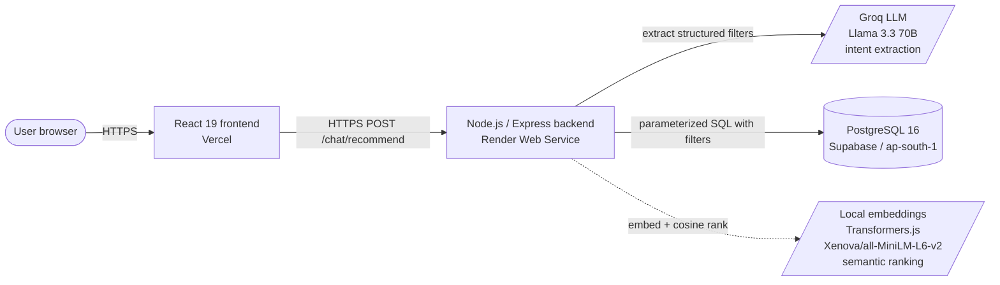
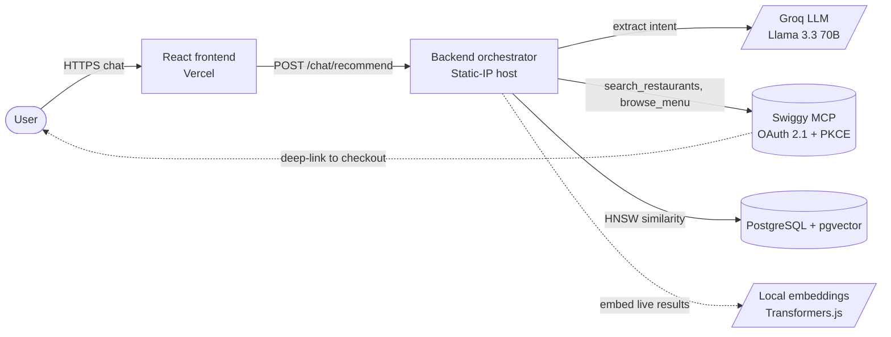

# Architecture

This document describes how the KhanaDedo — Backend is
structured today and how it will evolve once the planned Swiggy MCP
integration lands. It is the canonical reference for anyone reviewing
the system: integration partners, security reviewers, and contributors.

## Current architecture (deployed today)



### Request flow: anonymous recommendation

A user types a query in the frontend search bar. The frontend POSTs
`{ text }` to `/chat/recommend` on the backend. The backend:

1. Validates the body against a Zod schema.
2. **Extracts structured filters** (city, veg, vegan, max price, min
   protein) from the natural-language query. Two providers behind a
   common interface:
   - **Groq Llama 3.3 70B** (`FILTER_PROVIDER=groq`) — the default
     when `GROQ_API_KEY` is set. Sub-second JSON-mode call with a
     tightly-scoped prompt; falls back gracefully on any error.
   - **Regex** (`FILTER_PROVIDER=regex`) — rule-based fallback that
     covers the common patterns ("cheap"/"veg"/"under N rupees") with
     zero external dependency.
3. **Narrows the candidate set with SQL** — the extracted filters
   become `WHERE` clauses against `menu_items`. This is the hard
   constraint layer: anything that fails the filter is dropped before
   any AI scoring runs.
4. **Generates a 384-dim embedding** of the query in-process via
   `@xenova/transformers` (Xenova/all-MiniLM-L6-v2). No external API
   call.
5. **Cosine-ranks** the filtered candidates by similarity to the
   query embedding.
6. **Hybrid scoring** combines similarity (60%), protein-density
   (25%), and restaurant rating (15%) into a single sort key.
7. Returns top-N with both provider tags (`provider` for embeddings,
   `filterProvider` for Groq/regex) so the UI can show what produced
   the result.

Latency: ~800ms cold (model load + first Groq call), 200-400ms warm
(dominated by Groq round-trip + DB read).

### Why two AI components, not one

The two systems answer different questions and neither can replace
the other:

| Component       | Question it answers                           | Output                                  |
|-----------------|------------------------------------------------|------------------------------------------|
| Groq (Llama)    | *What did the user actually want?*             | `{veg: true, maxPrice: 300, ...}`        |
| Transformers.js | *Which items match most closely in meaning?*   | Cosine similarity scores per item        |

Pure semantic similarity can't enforce hard constraints. Without
Groq, a query like "vegan under 300 rupees" would rank a ₹400 paneer
dish high because the text similarity to "vegan vibes" is high — the
embedding doesn't enforce price or dietary correctness. The Groq
filter layer guarantees that only valid candidates reach the
similarity ranker.

Without Transformers.js, we'd be limited to exact filter matches —
"comfort food" or "something light" would return either everything
or nothing, since those have no structured equivalent in our schema.
Semantic similarity is what lets us rank ambiguous, vibes-based
queries.

### Component summary

| Component       | Tech                              | Hosted on   | Notes |
|-----------------|-----------------------------------|-------------|-------|
| Frontend        | React 19, Vite, TS, Tailwind, TanStack Query | Vercel      | Static SPA, talks to backend via `VITE_API_BASE` |
| Backend         | Node.js 22, TypeScript, Express 5 | Render Web Service (free tier) | Runs `node dist/server.js` |
| Database        | PostgreSQL 16                     | Supabase free tier (ap-south-1 Mumbai) | TLS enforced, includes pgvector |
| Embeddings      | `@xenova/transformers`, `Xenova/all-MiniLM-L6-v2`, 384-dim | in-process on backend | Optional dep; backend gracefully falls back to filter-only ranking if missing |
| Rate limiter    | api-rate-limiter (Python/FastAPI/Redis) | local-only at present | Not in the live request path; designed to be co-deployed in gateway mode |

### Endpoints

| Method | Path               | Auth     | Purpose |
|--------|--------------------|----------|---------|
| POST   | `/auth/signup`     | none     | Create user, optionally provision API key via rate-limiter |
| POST   | `/auth/login`      | none     | Issue 7-day JWT |
| GET    | `/profile/me`      | JWT      | Return logged-in user's profile |
| POST   | `/chat/recommend`  | none     | Public semantic recommendation |
| GET    | `/menu`            | none     | Browse seeded menu items with filters |
| GET    | `/health`          | none     | Liveness check |

### Production-readiness layer

- **Validation:** every endpoint runs its body/params/query through a
  Zod schema before reaching the controller.
- **Errors:** typed `ApiError` hierarchy + centralized error middleware
  returning structured JSON.
- **Migrations:** idempotent migration runner tracks applied files in
  a `_migrations` table; safe to run repeatedly.
- **Configuration:** environment-aware DB client supports both
  `DATABASE_URL` (managed cloud, with SSL) and individual `DB_*` vars
  (local).
- **CORS:** allowlist driven by `CORS_ORIGINS` env var.

## Target architecture (with Swiggy MCP, planned)



### Request flow: live Swiggy-backed recommendation

1. User submits a natural-language query.
2. Backend asks Groq (Llama 3.3 70B, free tier) to extract structured
   constraints into a typed JSON schema (price, nutrition, distance,
   keywords, dietary flags).
3. Backend calls Swiggy MCP tools — `search_restaurants` and
   `browse_menu` — to retrieve real restaurants and menu items near
   the user's saved address.
4. Backend embeds the live menu items in-process and ranks them
   against the user's query embedding using pgvector + an HNSW index
   for sub-linear similarity search at scale.
5. Backend combines semantic similarity with the structured
   constraints (price ceiling, distance, ratings) and returns a top-5
   with one-line LLM-generated rationales.
6. The user clicks a result; the frontend deep-links to Swiggy's app
   for actual checkout. **The backend never handles payment data.**

### What changes vs. today

| Concern              | Today                          | Target                                |
|----------------------|--------------------------------|---------------------------------------|
| Menu data            | Hand-seeded ~30 items          | Live from Swiggy MCP                  |
| Filter extraction    | Regex                          | LLM (Groq, free tier)                 |
| Vector storage       | JSONB, linear scan             | pgvector with HNSW index              |
| User identity for downstream calls | None (anonymous demo) | OAuth 2.1 + PKCE per user (Swiggy)    |
| Hosting              | Render (dynamic IPs)           | Static-IP host (Oracle Cloud Free)    |
| Rate limiter         | Local only                     | Co-deployed gateway in front of orchestrator |

### Auth model in the target architecture

- **End-user identity:** JWT issued by `/auth/login`, used to identify
  the user across requests.
- **Per-user Swiggy authorization:** OAuth 2.1 + PKCE flow during
  onboarding. The backend exchanges the auth code for a refresh
  token, stores the refresh token encrypted at rest, and uses it to
  obtain short-lived access tokens for Swiggy MCP calls.
- **Gateway rate limiting:** the api-rate-limiter sits in front of the
  orchestrator, enforcing per-user request budgets via API key auth
  before the orchestrator does any work.

## Repository layout

```
ai-food-backend/
├── src/
│   ├── app.ts                 Express app: CORS, JSON, gateway mw, routes
│   ├── server.ts              Listen / loopback-bind in gateway mode
│   ├── core/
│   │   ├── db/                pg Pool, env-aware config
│   │   ├── embeddings/        Provider abstraction (local | future paid)
│   │   ├── errors.ts          ApiError hierarchy
│   │   ├── rate-limiter-client/   Admin client for api-rate-limiter
│   │   └── modules/
│   │       ├── auth/          signup, login, JWT issuance
│   │       ├── chat/          /chat/recommend, ranker
│   │       ├── menu/          menu CRUD, filter SQL
│   │       └── profile/       /profile/me
│   └── middleware/
│       ├── auth.middleware.ts         JWT verification
│       ├── error.middleware.ts        Centralized error handling
│       ├── gateway-auth.middleware.ts Read X-Authenticated-* headers
│       └── validate.middleware.ts     Zod request validation
├── migrations/                Idempotent SQL migrations
├── scripts/                   migrate, seed, generateEmbeddings
├── render.yaml                Infra-as-code blueprint
├── PRIVACY.md
├── SECURITY.md
└── docs/
    └── ARCHITECTURE.md (this file)
```

## Live URLs

- Frontend: https://khanadedo.vercel.app
- Backend API: https://ai-food-backend-ib8i.onrender.com
- Backend health: https://ai-food-backend-ib8i.onrender.com/health
- Frontend repo: https://github.com/rohitanakiya/KhanaDedo-frontend
- Backend repo: https://github.com/rohitanakiya/KhanaDedo
- Rate-limiter repo: https://github.com/rohitanakiya/api-rate-limiter

Last updated: 2026-06-03.
